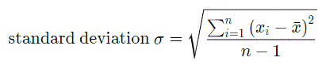
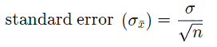
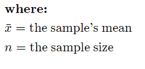

# Stat
Windows 64 bit console app to calculate sample statistics on a set of numbers entered on the command line

The build instructions are at the top of the source code.

Example:

```Stat 14.0, 15.0, 16.0, 17.0, 18.0```

Output:
```
Average = 16.000
Std Dev = 1.581
Std Err = 0.707
Num Pts = 5
    
    90% Confidence Interval = 16.000±1.163
    95% Confidence Interval = 16.000±1.386
    99% Confidence Interval = 16.000±1.821
  99.9% Confidence Interval = 16.000±2.327
 99.99% Confidence Interval = 16.000±2.751
99.999% Confidence Interval = 16.000±3.123
```

The program calculates the mean, standard deviation, standard error and confidence intervals of a sample. 
The mean is just the sum of the data points divided by the number of data points, the other equations are as follows:






